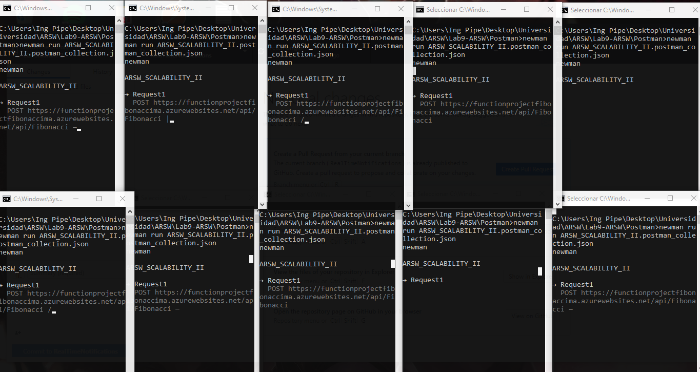
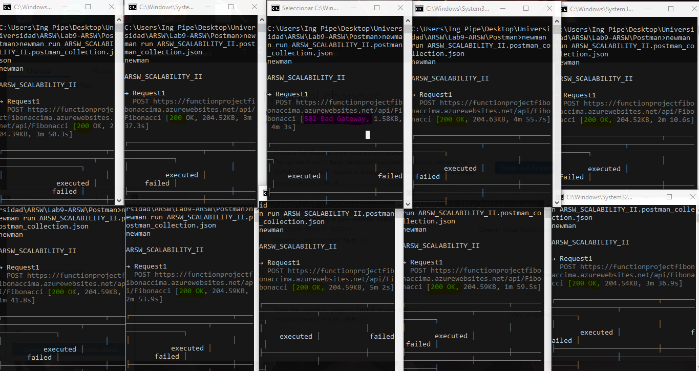
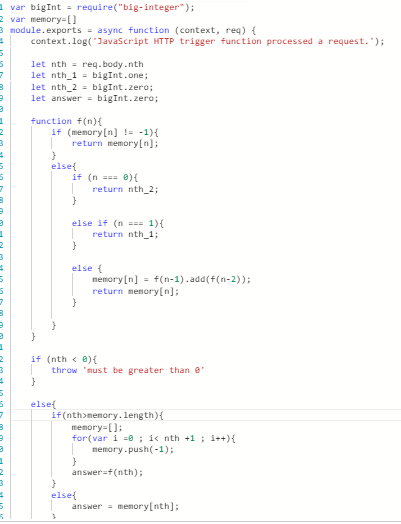
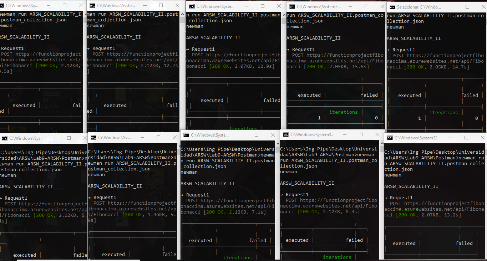
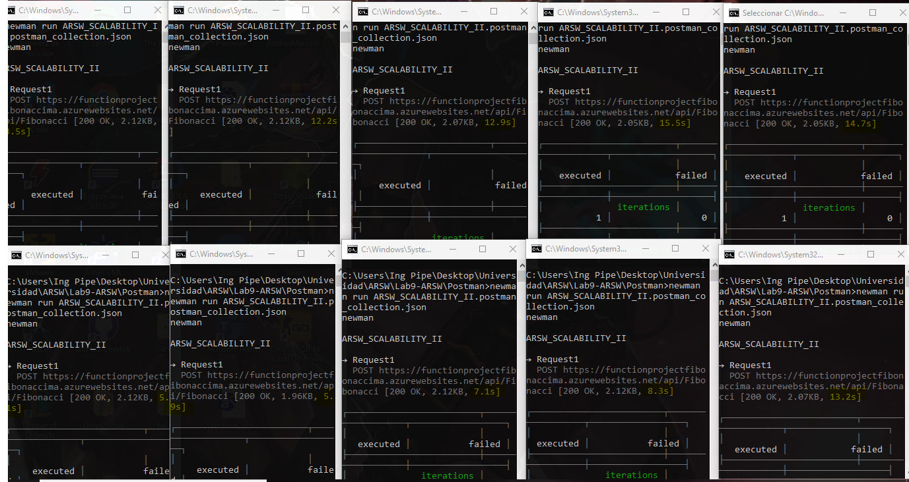

### Escuela Colombiana de Ingeniería
### Arquitecturas de Software - ARSW

## Escalamiento en Azure con Maquinas Virtuales, Sacale Sets y Service Plans

### Dependencias
* Cree una cuenta gratuita dentro de Azure. Para hacerlo puede guiarse de esta [documentación](https://azure.microsoft.com/en-us/free/search/?&ef_id=Cj0KCQiA2ITuBRDkARIsAMK9Q7MuvuTqIfK15LWfaM7bLL_QsBbC5XhJJezUbcfx-qAnfPjH568chTMaAkAsEALw_wcB:G:s&OCID=AID2000068_SEM_alOkB9ZE&MarinID=alOkB9ZE_368060503322_%2Bazure_b_c__79187603991_kwd-23159435208&lnkd=Google_Azure_Brand&dclid=CjgKEAiA2ITuBRDchty8lqPlzS4SJAC3x4k1mAxU7XNhWdOSESfffUnMNjLWcAIuikQnj3C4U8xRG_D_BwE). Al hacerlo usted contará con $200 USD para gastar durante 1 mes.

### Parte 0 - Entendiendo el escenario de calidad

Adjunto a este laboratorio usted podrá encontrar una aplicación totalmente desarrollada que tiene como objetivo calcular el enésimo valor de la secuencia de Fibonnaci.

**Escalabilidad**
Cuando un conjunto de usuarios consulta un enésimo número (superior a 1000000) de la secuencia de Fibonacci de forma concurrente y el sistema se encuentra bajo condiciones normales de operación, todas las peticiones deben ser respondidas y el consumo de CPU del sistema no puede superar el 70%.

### Escalabilidad Serverless (Functions)

1. Cree una Function App tal cual como se muestra en las  imagenes.

2. Instale la extensión de **Azure Functions** para Visual Studio Code.

3. Despliegue la Function de Fibonacci a Azure usando Visual Studio Code. La primera vez que lo haga se le va a pedir autenticarse, siga las instrucciones.

4. Dirijase al portal de Azure y pruebe la function.

5. Modifique la coleción de POSTMAN con NEWMAN de tal forma que pueda enviar 10 peticiones concurrentes. Verifique los resultados y presente un informe.  
Se hicieron los request de la siguiente forma:  
  
La salida de cada uno de ellos fue:  
  
En esta imagen se presentan las response de los casos, Hubo un caso en donde hubo un internal server error debido a la sobrecarga de operaciones porque para el mismo caso se estaban ejecutando el mismo algoritmo.  
A continuacion evidenciamos la misma salida pero los tiempo resaltados:  
  
Se vio un tiempo estimado de 3 minutos en cada ejecucion, totalmente variable, pero se llegó a la meta de calcular el numero 1000000 de la sucesion fibonacci, sin embargo se vio afectado el tiempo de ejecución para cumplirla.  
Se puede concluir que a pesar de que el algoritmo es ineficiente para el proposito de la función, cumple con el objetivo en la mayoria de los casos pero con un costo alto de tiempo y de recursos que puede llevar a ocasionar una caida del sistema.

6. Cree una nueva Function que resuleva el problema de Fibonacci pero esta vez utilice un enfoque recursivo con memoization. Pruebe la función varias veces, después no haga nada por al menos 5 minutos. Pruebe la función de nuevo con los valores anteriores. ¿Cuál es el comportamiento?.  
  
Se realizo un cambio al codigo, de manera que ahora el algoritmo se ejecuta de forma recursiva y las salidas se almacenan en una estructura de datos.  
A continuación se presentan las salidas de las request, en este caso TODOS los casos dieron una respuesta OK 
  
Ahora en comparacion con los tiempos se vio un tiempo reducido entre las requests, pues cuando se ejecutaron algunas funciones ya el valor solicitado estaba en memoria.  
  
  
Sin embargo, el uso de este algoritmo nos limitó en terminos de casos maximos a calcular. Pues si se probaba con 1M de casos, el tamaño del stack se excedía y el sistema no lo soportaba... por lo tanto mandaba error  
Se puede hacer una comparativa en relacion a los tiempos de ejecucion y simularlo con el caso de 1M, como se mencionó anteriormente, algunas de las funciones se ejecutaban cuando ya habia una respuesta almacenada lo que provocaba una reducción de los tiempos y un gran ahorro de recursos.

**Preguntas**

* **¿Qué es un Azure Function?**

  Azure Functions permite ejecutar pequeñas piezas de código (llamadas "funciones") sin preocuparse por la infraestructura de la          aplicación. Con Azure Functions, la infraestructura de la nube proporciona todos los servidores actualizados que necesitas  para mantener tu aplicación funcionando a escala.

   Una función es "disparada" por un tipo específico de evento. Entre los desencadenantes compatibles se incluyen la respuesta a cambios en los datos, la respuesta a mensajes, la ejecución en un horario o como resultado de una solicitud HTTP.

   Aunque siempre se puede codificar directamente contra una gran cantidad de servicios, la integración con otros servicios se 
   agiliza mediante el uso de bindings. Los bindings te dan acceso declarativo a una amplia variedad de servicios de Azure y de 
   terceros.
    
* **¿Qué es serverless?**
    En general, el término serverless se emplea para referirse al modelo de computación según el cual el proveedor de la capa de computación nos permite ejecutar durante un periodo de tiempo determinado porciones de código denominadas "funciones" sin necesidad de hacernos cargo de la infraestructura subyacente que se provisiona para dar el servicio. En este modelo, el proveedor se encarga de ofrecer los recursos de forma transparente, de escalarlos automáticamente si crece la demanda y de liberarlos cuando no son utilizados, definiendo una serie de restricciones referentes al procesamiento y un modelo de pago por el consumo de los recursos derivados de la ejecución.
    
* **¿Qué es el runtime y que implica seleccionarlo al momento de crear el Function App?**

Es el intervalo de tiempo en el que un programa de computadora se ejecuta en un sistema operativo. En Azure esta principalmente está relacionado con la versión de .NET en la que se basa el tiempo de ejecución.
  Al seleccionar el plan Consumption y la versión de runtime 2, implica que su "timeout duration" es de 5 minutos.
  
* **¿Por qué es necesario crear un Storage Account de la mano de un Function App?**

  Es necesario debido a que el Storage Account nos proporciona un espacio de nombres unico para poder almacenar todos los datos  
  provenientes de Azure   Storage, consulatados mediante HTTP
  
* **¿Cuáles son los tipos de planes para un Function App?, ¿En qué se diferencias?, mencione ventajas y desventajas de cada uno de ellos.**
  
  1. **Plan de consumo:** Cuando se usa el plan de consumo, las instancias del host de Azure Functions se agregan y quitan de forma dinámica según el número de eventos entrantes. Este plan sin servidor se escala automáticamente y solo se le cobra por los  recursos de proceso cuando se ejecutan las funciones. En un plan de consumo, se agota el tiempo de espera de una ejecución.

      * **Ventajas:**

        * Pague solo cuando se ejecutan las funciones
        * Escale horizontalmente de forma automática, incluso durante períodos de gran carga

  2. **Plan Premium:** Cuando se usa el plan Prémium, las instancias del host de Azure Functions se agregan y quitan según el número  de eventos entrantes al igual que con el plan de consumo.
  
      * **Ventajas:**
      
        * Constancias permanentemente semiactivas para evitar cualquier inicio en frío
        * Conectividad de red virtual
        * Duración de la ejecución ilimitada (60 minutos garantizados)
        * Tamaños de la instancia Prémium (un núcleo, dos núcleos y cuatro instancias de núcleo)
        * Precios más previsibles
        * Asignación de aplicaciones de alta densidad para planes con varias aplicaciones de funciones
        
  3. **Plan Dedicado (App Service)**: Sus aplicaciones de funciones también pueden ejecutarse en las mismas máquinas virtuales   dedicadas que otras aplicaciones de App Service (SKU básica, estándar, prémium y aislada).
 
        * **Ventajas:**
        
          * Tiene máquinas virtuales infrautilizadas que ya ejecutan otras instancias de App Service.
          * Se puede proporcionar una imagen personalizada en la que ejecutar sus funciones.
              
 En términos generales la diferencia de ellos radica en los distintos enfoques que cada cual tiene,por ejemplo, el Plan de Consumo es el plan más sencillo el cual se basa exclusivamente de acuerdo a la demanda del usuario, el Plan Premium está basado en le hecho de tener memoria para poder reutilizar los trabajos anteriores y el Plan Dedicado está enfocado para quienes necesitan ejecutar tareas que tienen una duracion considerable.
         
* **Por qué la memoization falla o no funciona de forma correcta?**

  La memorización no funcionó correctamente debido a que después de un lapso de tiempo de no hacer ninguna petición la memorización de borró estando obligada a recalcular el valor.
  
* **¿Cómo funciona el sistema de facturación de las Function App?**

     * **Ejecuciones:** Se Factura en base al numero total de ejecuciones solicitadas cada mes para las funciones.

     * **Consumo de recursos:** Se factura en base a la memoria promedio en GB/s por tiempo que se demora en ejecutar la tarea.

     * **Premium:** En este plan se factura en base a la CPU y la memoria que utiliza la function app.

